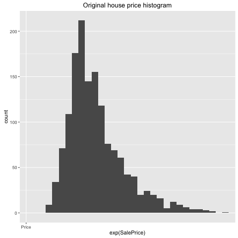
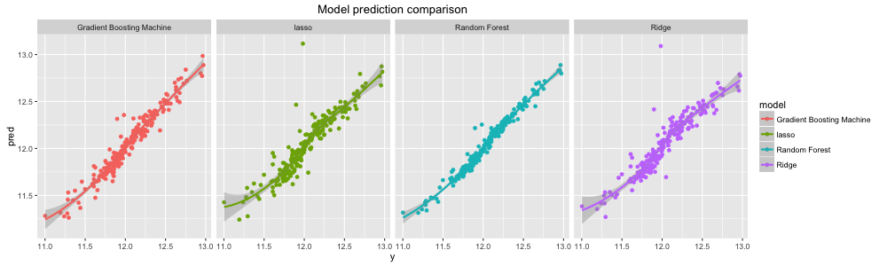

## House Price -- Advanced Regression Techniques

* Statistics - National Association of Realtors
* Significance of The Project


## Agenda

* Project Objective
* Data Description
* Exploratory Data Analysis
* Methodology
* Feature Engineering
* Analysis and Key Findings
* Conclusions

## Project Objective
* Make full use of statistical models and predictive tools 
* Explore variable relationships, predict housing price and raise interesting questions from the dataset
    * **Prediction Accuracy**
    * **Model Interpretability**. 

## Data Description
Our analysis starts with the data sets provided by Kaggle Competition on  [House Price](https://www.kaggle.com/c/house-prices-advanced-regression-techniques/data). There are three files:

* `data_description.txt` 
* `train.csv` 
* `test.csv` 

The dataset has 80 variables in total, including both categorical and numerical variables.

Our goal is to understand the relationship between `SalePrice` and these potential predictors with statistical modeling.


## Exploratory Data Analysis
With datasets in hand, the first thing we would like to explore is the dataset itself: what are some interesting relationships among variables and what human interpretation can we give to these observations? 





## Methodology

**Goal**: accurately predict the final price of each home

**Problem Framing**: regression problem

**Methods**: L2 loss function

* Data Preprocess 
* Feature Engineering
* Shrinkage models and ensemble models.

## Methodology

1. Objective Loss Function
<div class="blue2">
$$\epsilon = \sqrt{\frac{1}{n} \sum_{i=1}^{n} (log(p_{i} + 1) - log(a_{i} + 1))^2}$$
</div>

2. Data Preprocess
    - **Factorization**: dealing with categorical variables
    - **Missing Values**: dealing with NA values
    - **Log Transformation**: dealing with highly-skewed variables
    - **Outliers**: removing 17 outliers

## Data Preprocess - Log Transformation


## Feature Engineering

**Problem 1**: Complexity of the Dataset

**Approach**: Dimension reduction and extraction of informative, feature engineered predictors

**Problem 2**: Small dataset

**Approach**: Manual feature engineering instead of feature learning

## Feature Engineering


## Modeling

* **Shrinkage Regression Models** 
    * PCA - information compression
    * Lasso - L1 norm
    * Ridge - L2 norm

* **Ensemble Models**
    * Gradient Boosting Machine - Boosting 
    * Random Forest - Bagging with a random trick


## Principal Component Analysis


## MSE - Lasso and Ridge Regression


## Top 10 Coefficients for Lasso and Ridge


## Model GBM Predictor Importance

<center>

</center>


## Results - Model Prediction Comparison




## Results - RMSLE Comparison

```{r echo = FALSE, results='asis'}  
load("../data/cleanedData/RMSEL_Table.RData")
library(knitr)
xtable1 <- kable(model_comparison, caption = 'Table: RMSEL Comparison from Four Models')
print(xtable1, comment=FALSE, type = "latex", caption.placement = 'top')
```

\newline

**Random Forest** seems to have the smallest RMSLE

## Conclusions

In conclusions, it is feasible to predict the house price with more informative predictors we created. 

To emphasize collaborative teamwork and project reproducibility, we also wrote blog post and code documentation (kernel) so that more people can benefit and make use of our results.


## Acknowledgments

The Ames Housing dataset was compiled by Dean De Cock for use in data science education. It's an incredible alternative for data scientists looking for a modernized and expanded version of the often cited Boston Housing dataset. 

Special thanks to Professor Gaston Sanchez and GSI Sindhuja Jeyabal.

