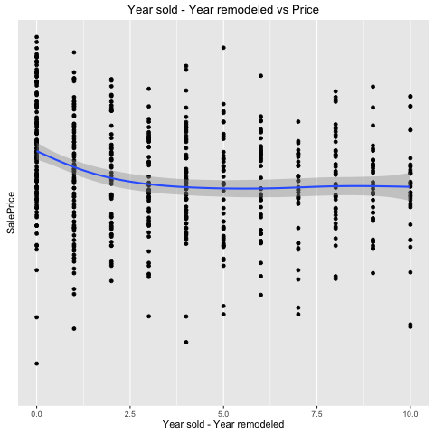

## House Price: Advanced Regression Techniques


## Agenda

* Project Objective
* Data Description
* Exploratory Data Analysis
* Methodology
* Applied Methods
* Feature Engineering
* Key Findings
* Conclusions
* Acknowledgement

## Project Objective
To make full use of statistical models and predictive tools we have learned from the class and challenge ourselves to the next level, we choose to complete **"House Price: Advanced Regression Techniques"** from Kaggle Competition and have entered the competition with our work. 

Aiming to explore relations, predict housing price and raise interesting questions from the given dataset, we want to achieve both **Prediction Accuracy** and **Model Interpretability**. 

## Data Description
Our analysis starts with the data sets provided by Kaggle Competition on  [House Price](https://www.kaggle.com/c/house-prices-advanced-regression-techniques/data). In the information provided, `data_description.txt` gives the official definition for fields, This data set records; `train.csv` provides 1459 real observations that can be used for model construction; `test.csv` is used to fit the predictive model and create submission.

The dataset has 79 variables in total, including both categorical and numerical variables.

Our goal is to understand the relationship between `SalePrice` and these potential predictors with statistical fitting procedures.


## Exploratory Data Analysis
With datasets in hand, the first thing we would like to explore is the dataset itself: what are some interesting relationships among variables and what human interpretation can we give to these observations? 

<center>

</center>


## Methodology

The goal of this analysis is to accurately predict the final price of each home. Therefore, we frame this problem as a regression problem, and decide to use the L2 loss function which is often used in regression problem. 

Taking this objective into account, we preprocess original dataset so that regression models can work well. Furthermore, we extract more features by involving feature engineering. Finally, we fit two shrinkage models and two ensemble models.

## Applied Methods

1. Objective Loss Function
<div class="blue2">
$$\epsilon = \sqrt{\frac{1}{n} \sum_{i=1}^{n} (log(p_{i} + 1) - log(a_{i} + 1))^2}$$
</div>

2. Data Preprocess
    - **Factorization**: dealing with NA values
    - **Log Transformation**: dealing with area-related variables
    - **Outliers**: dataset highly sensitive to outliers


## Data Preprocess - New Variables




## Data Preprocess - Log Transformation


## Feature Engineering

Considering the complexity of the problem as well as the number of observations and predictors, we assume that the success of this analysis is largely dependent on **informative, feature engineered predictors** that can reveal the subtle relationship to our target variable. Given the small size of dataset with 1460 observations, we conclude that feature learning is not a feasible option because feature learning often involves very complicated models with multiple layers, which tends to cause an overfitting issue when dataset is small.

With this observation, we therefore focus more on **manual feature engineering**. This process is a important stepping-stone in that it helps reveal significant predictors that are previously not represented well in original dataset.

## Model Comparison

We utilize both **shrinkage regression models** and **ensemble models**. Practitioners often favor ensemble models due to their conveniences. Ensemble models such as **Random Forest**, which uses the averaged result from the randomly grown decision trees such as CART, often work well with unscaled, missing data and are used for both classification and regression problems. Also, since our dataset contains a hug number of predictors, shrinkage methods such **Lasso** and **Ridge regressions**, which penalize predictors by shrinking their weights, can be highly effective. Furthermore, we utilize a dimension reduction technique called **PCA** in order to compress information into lower dimension.


## Principal Component Analysis


## MSE - Lasso and Ridge Regression


## Top 10 Coefficients for Lasso and Ridge


## Results - Model Prediction Comparison


## Results - RMSLE Comparison

```{r echo = FALSE, results='asis'}  
load("../data/cleanedData/RMSEL_Table.RData")
library(knitr)
xtable1 <- kable(model_comparison, caption = 'Table: RMSEL Comparison from Four Models')
print(xtable1, comment=FALSE, type = "latex", caption.placement = 'top')
```

\newline

**Random Forest** seems to have the smallest RMSLE

## Conclusions

In conclusions, we explore and compare the usage of different regression models on the train dataset and fit the model for predictions in the test dataset. Solving problems to the next level and applying advanced regression techniques, we obtained a better understanding of the data, potential predictors and useful techniques. Along the completition of this project, we emphasized team collaboration, project reproducibility and adventurous strategy. Great conclusion to the end of this class!

## Acknowledgments

The Ames Housing dataset was compiled by Dean De Cock for use in data science education. It's an incredible alternative for data scientists looking for a modernized and expanded version of the often cited Boston Housing dataset. 

Special thanks to Professor Gaston Sanchez and GSI Sindhuja Jeyabal.

